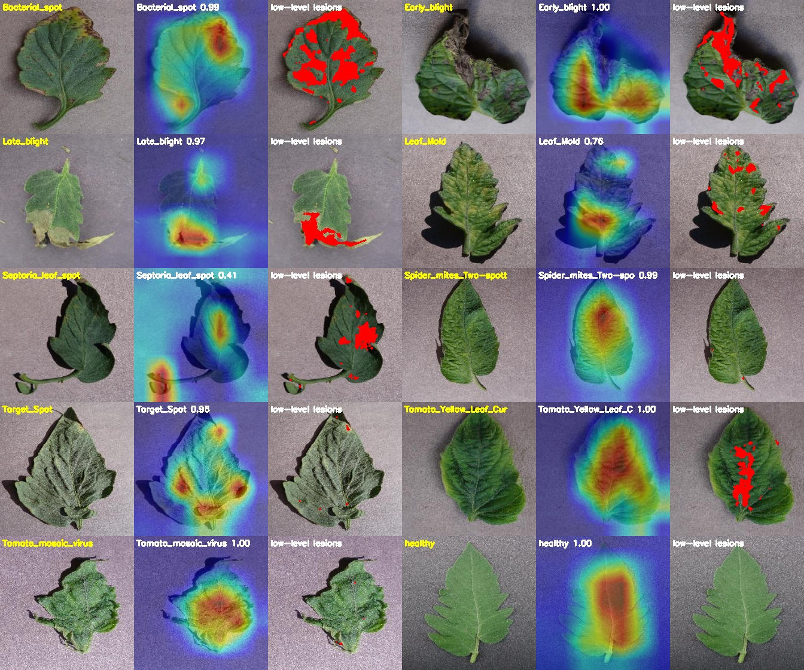
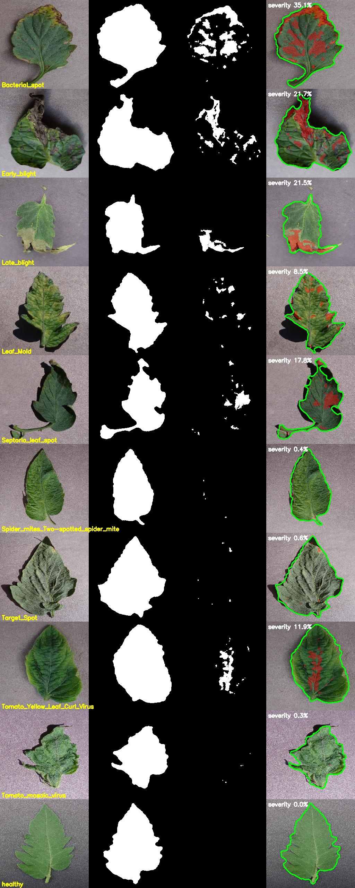
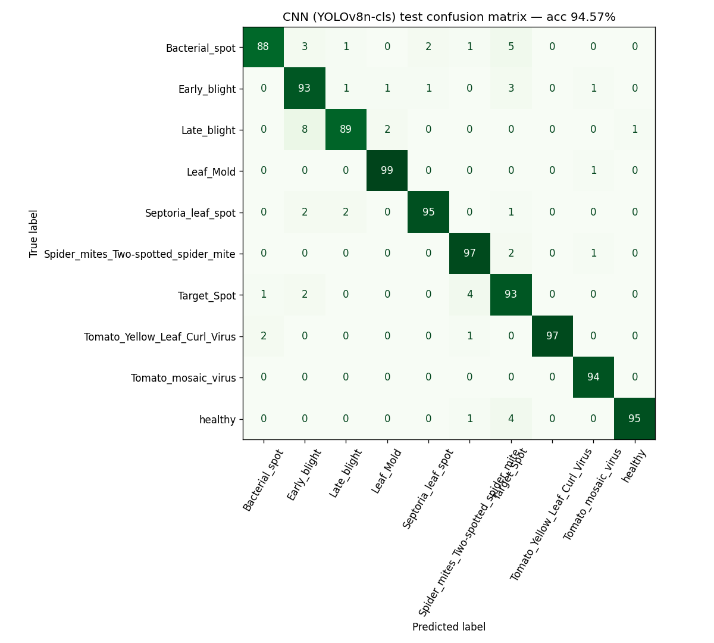
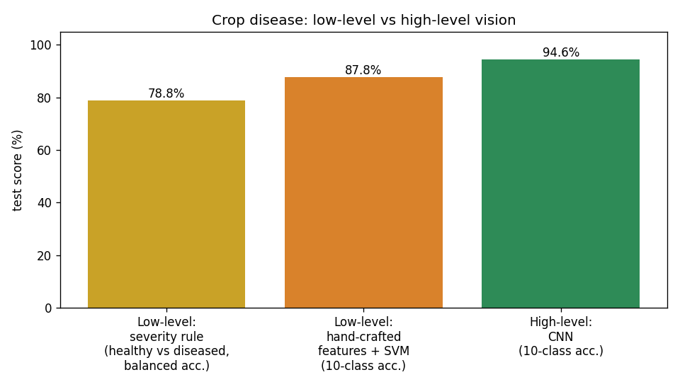
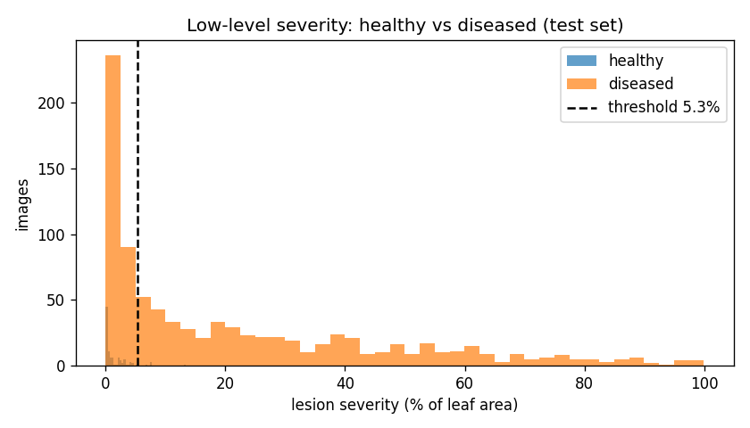

# Project 1: AI-Based Crop Disease Detection (Tomato Leaves)



## Problem statement
Plant diseases reduce crop yields, and farmers often can't identify them early. Symptoms such as spots, blight, mould and mosaic show up on the leaf surface, so a camera and a computer vision model can screen leaves automatically.

## Objective
1. **Low-level vision:** segment the leaf and the diseased (lesion) pixels using only colour, filtering and morphology, and estimate **disease severity (% of leaf area)**. Also build a classical classifier from hand-crafted colour and texture features.
2. **High-level vision:** fine-tune a pretrained CNN to recognise **10 classes** (9 tomato diseases plus healthy), and explain its decisions with **Grad-CAM**.
3. Compare the two approaches on the same held-out test set.

## Dataset
**PlantVillage**: lab photos of single leaves on a plain background. We use the 10 **tomato** classes.

| | Link |
|---|---|
| Kaggle | https://www.kaggle.com/datasets/abdallahalidev/plantvillage-dataset (`color/` folder) |
| Original (GitHub) | https://github.com/spMohanty/PlantVillage-Dataset (`raw/color/`), the copy used for these runs |

A balanced subset is created by `src/prepare_data.py` (seed 42). It has **250 train / 50 val / 100 test images per class**, except Tomato_mosaic_virus, which has only 373 images in total (233/46/94). That makes 2,483 train, 496 val and 994 test images. See [`dataset/README.md`](dataset/README.md).

## Methodology

### A. Low-level vision (no learning): `src/lowlevel_segmentation.py`
| Step | Operation |
|---|---|
| Pre-processing | resize 256×256, **median filter** (denoise), BGR → **HSV** |
| Leaf mask | colour threshold (hue 8–95, S>30, V>30) → **morphological closing + opening** → largest **contour** |
| Lesion mask | inside the eroded leaf, saturated pixels whose hue is **not** healthy green (35–65): yellow chlorosis, brown necrosis, grey mould → opening |
| Severity | lesion pixels / leaf pixels × 100 |
| Decision | *diseased* if severity > threshold (threshold picked on val by balanced accuracy) |
| Hand-crafted features | HSV colour histograms, Sobel gradient histogram, **LBP texture** histogram, Laplacian variance, severity → **SVM (RBF)** (`src/lowlevel_evaluate.py`) |

### B. High-level vision (deep learning): `src/train.py`, `src/evaluate.py`, `src/gradcam.py`
- **YOLOv8n-cls** (a CNN pre-trained on ImageNet), fine-tuned end-to-end: 224×224, 8 epochs, AdamW (auto), flips plus light colour jitter. Hue jitter is kept tiny because colour *is* the symptom.
- **Grad-CAM** on the last convolutional block shows which pixels drove the decision. We also measure how much of the Grad-CAM heat falls on the low-level lesion mask, which links the two levels.

## Tools / libraries
Python 3.10+, OpenCV, NumPy, scikit-learn, PyTorch, Ultralytics YOLOv8, Matplotlib.

## Results (test set, 994 images)

| Method | Task | Metric | Score |
|---|---|---|---|
| Low-level severity rule | healthy vs diseased | balanced accuracy / ROC-AUC | **78.8 % / 86.1 %** |
| Low-level features + SVM | 10 classes | accuracy / macro-F1 | **87.8 % / 87.8 %** |
| **High-level CNN (YOLOv8n-cls)** | 10 classes | accuracy / macro-F1 | **94.6 % / 94.6 %** |
| High-level CNN | healthy vs diseased | accuracy | **99.4 %** |

CPU inference for the CNN takes 9.3 ms per image. Per-class numbers are in `results/highlevel/metrics.json` and `results/lowlevel/lowlevel_metrics.json`.

| Low-level segmentation (input, leaf mask, lesion mask, overlay) | CNN confusion matrix |
|---|---|
|  |  |

| Low-level vs high-level | Severity distribution |
|---|---|
|  |  |

More: `screenshots/sample_predictions.jpg`, `screenshots/svm_confusion_matrix.png`, `screenshots/cnn_training_curves.png`.

**Grad-CAM check:** on diseased test leaves, 12.8 % of the Grad-CAM energy lies on the low-level lesion pixels, which cover 10.3 % of the leaf. So the CNN looks at lesions somewhat more than chance, but it also uses leaf shape and texture (spider mites and viral classes have almost no colour lesions).

## Conclusion
Low-level colour segmentation is **interpretable and gives a physical severity %**, but hue alone can't separate diseases that keep the leaf green (viruses, mites). Shadows and specular highlights also cause errors. Hand-crafted texture features plus an SVM recover a lot (87.8 %). The CNN learns richer features and reaches **94.6 %** on 10 classes and 99.4 % on healthy vs diseased. The best practical system combines both: CNN for the diagnosis and the low-level mask for severity.

## How to run
```bash
pip install -r requirements.txt
# 1. get data (Kaggle API or GitHub, see dataset/README.md), then:
python src/prepare_data.py --src "<path>/color"
# 2. low-level
python src/lowlevel_segmentation.py --demo
python src/lowlevel_evaluate.py
# 3. high-level
python src/train.py --epochs 8            # add --device 0 on a GPU
python src/evaluate.py
python src/gradcam.py
# single image
python src/lowlevel_segmentation.py --image leaf.jpg
yolo classify predict model=models/leaf_cls_yolov8n.pt source=leaf.jpg
```
The trained weights are included: `models/leaf_cls_yolov8n.pt` (3 MB).

See [`report.md`](report.md) for the full project report.
