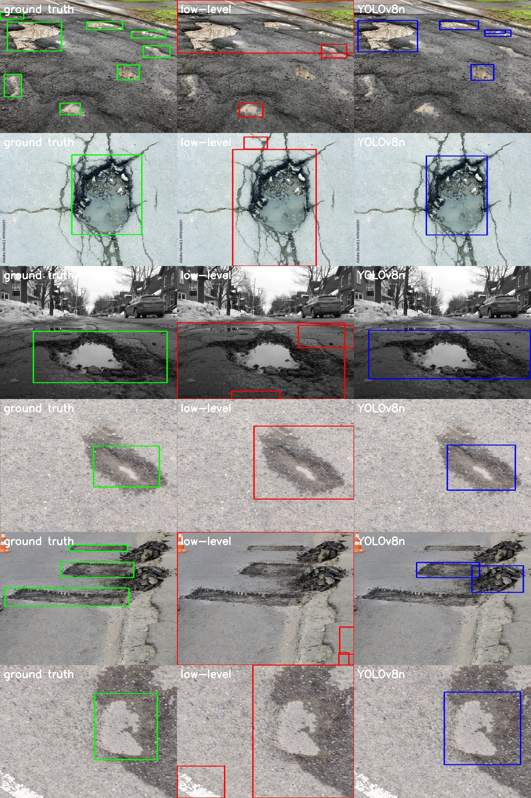
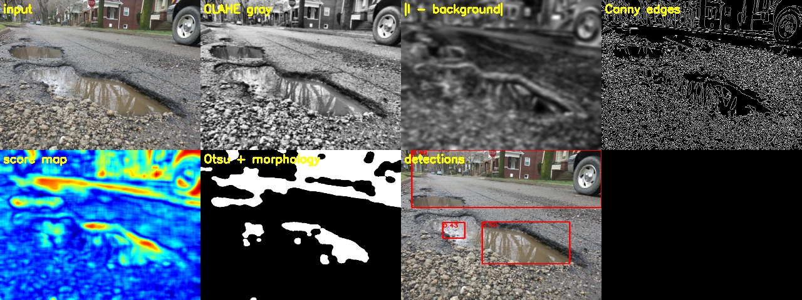
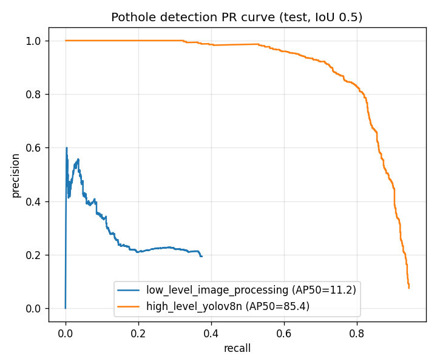
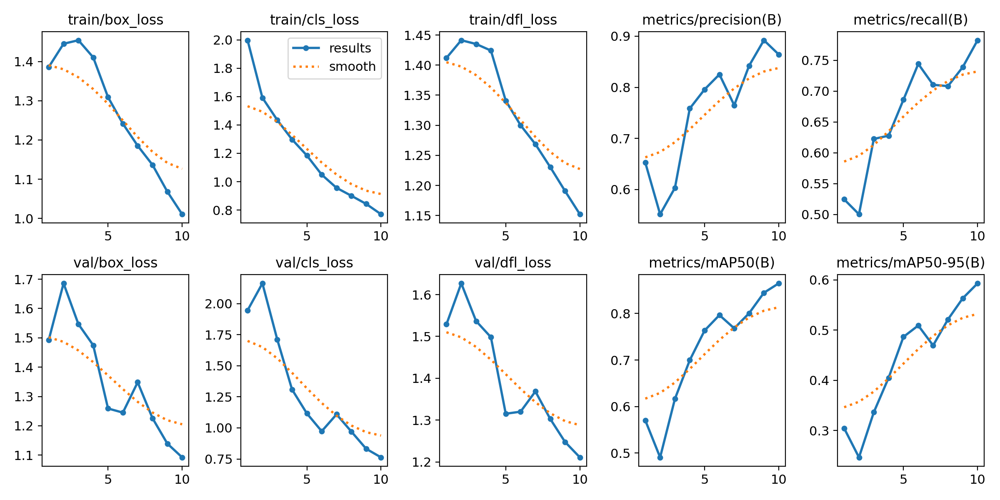

# Project 2: Road Pothole Detection Using Computer Vision


*Green = ground truth, red = low-level image processing, blue = YOLOv8n*

## Problem statement
Potholes damage vehicles and cause accidents, and cities find them mainly through manual surveys and citizen complaints. A camera on a car or phone could detect and map potholes automatically. They vary widely in size, shape, colour (dry, wet, filled with water) and lighting, which makes this hard.

## Objective
1. **Low-level vision:** locate potholes with classical image processing only: contrast enhancement, filtering, edges, texture and intensity anomalies, thresholding, morphology, contours.
2. **High-level vision:** train a deep object detector (YOLOv8n) with transfer learning.
3. Evaluate both with the same object-detection metrics (AP@0.5, precision, recall, F1) on a held-out test set.

## Dataset
A merged pothole dataset in **YOLO format** (1 class, "pothole"): **4,054 images, 5,601 boxes**, built from three public pothole datasets.

| split | images | boxes |
|---|---|---|
| train | 2,749 | – |
| val | 654 | 806 |
| test | 651 | 833 |

- Source used: https://github.com/Bisman-Singh-Dev/YOLO-Pothole-Detection-Model (`dataset/` folder)
- Kaggle sources of the same kind of data: https://www.kaggle.com/datasets/andrewmvd/pothole-detection (665 images, VOC) and https://www.kaggle.com/datasets/chitholian/annotated-potholes-dataset

See [`dataset/README.md`](dataset/README.md) for download commands.

## Methodology

### A. Low-level vision (no learning): `src/lowlevel_detector.py`
| # | Step | Operation |
|---|---|---|
| 1 | Normalise | resize to 640 px wide, grayscale, **CLAHE** |
| 2 | Local anomaly | \|I − Gaussian-blurred background (σ = 31)\| |
| 3 | Texture anomaly | **Canny** edges → 31×31 box filter = edge density; \|density − median\| (potholes are smoother *or* rougher than asphalt) |
| 4 | Intensity anomaly | \|smoothed I − median I\| |
| 5 | Score map | 0.3·local + 0.4·texture + 0.3·intensity |
| 6 | Segmentation | **Otsu threshold** → **closing** 25×25 → **opening** 15×15 |
| 7 | Region filtering | **contours**, area 0.4–60 % of image, solidity > 0.45, aspect ratio 0.2–6 |
| 8 | Output | bounding boxes with confidence = mean score (top 3) |



### B. High-level vision (deep learning): `src/train.py`
**YOLOv8n** (3.2 M parameters, COCO-pretrained, anchor-free detector) fine-tuned for 10 epochs at 416×416, batch 16, with Ultralytics default augmentation (mosaic, HSV, flips, scaling).

## Tools / libraries
Python, OpenCV, NumPy, Ultralytics YOLOv8, PyTorch, Matplotlib.

## Results (test set: 651 images, 833 potholes)

| Method | AP@0.5 | Precision | Recall | F1 | Time / image (CPU) |
|---|---|---|---|---|---|
| Low-level image processing | 11.2 % | 21.4 % | 36.3 % | 26.9 % | 106 ms |
| **YOLOv8n** | **85.4 %** | **83.4 %** | **79.7 %** | **81.5 %** | 48 ms |

Ultralytics' own validator on the same test split gives YOLOv8n **mAP@0.5 = 85.5 %** and **mAP@0.5:0.95 = 59.7 %** (P 83.8 %, R 79.5 %). This agrees with our own metric code.

| PR curves (same metric code for both) | YOLO training curves |
|---|---|
|  |  |

More: `screenshots/yolo_test_predictions.jpg` vs `screenshots/yolo_test_ground_truth.jpg`, `screenshots/yolo_test_PR_curve.png`, and `results/lowlevel_pipeline_examples.jpg`.

## Conclusion
Low-level cues (contrast, texture and intensity anomalies) often find the right region: note the 36 % recall. But the boxes are loose, and shadows, cracks, patches, lane paint and wet asphalt produce many false alarms, so AP@0.5 is only 11 %. There is no pixel-level definition of "pothole" that holds across roads and lighting. YOLOv8n learns that concept from 2,749 labelled examples and reaches **85 % AP@0.5**, about **8× better**, and is also faster. Low-level processing remains useful to explain the visual evidence and as a cheap pre-filter, but reliable detection needs high-level learned features.

## How to run
```bash
pip install -r requirements.txt
# get the dataset into ./data  (images/{train,val,test}, labels/{train,val,test}); see dataset/README.md
python src/lowlevel_detector.py --image dataset/sample_images/pothole_dataset_2_00608.jpg --out lowlevel.jpg
python src/train.py --epochs 10            # add --device 0 on a GPU; or use models/pothole_yolov8n.pt
python src/evaluate.py                     # compares low-level vs YOLO on the test split
yolo detect predict model=models/pothole_yolov8n.pt source=dataset/sample_images   # quick demo
```
Trained weights are included: `models/pothole_yolov8n.pt` (6 MB). Full report: [`report.md`](report.md).
