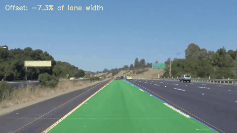
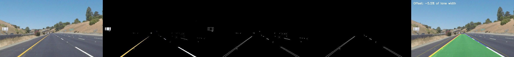
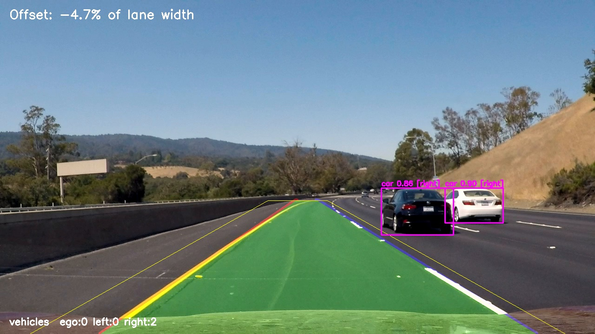
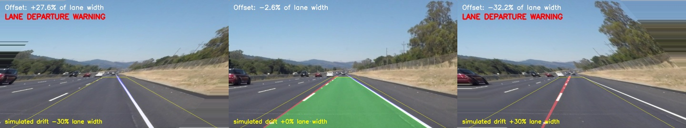
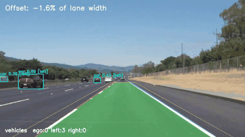

# Project 3: Road Lane Detection and Departure Warning



## Problem statement
Unintended lane departure is a major cause of highway crashes. A forward-facing camera can find the lane markings, estimate where the car sits inside its lane, and warn the driver before the car drifts out. A driver-assistance system also needs to know what is in the lane (other vehicles), not only where the paint is.

## Objective
1. **Low-level vision:** detect the left and right lane lines using colour masking, edge detection and the Hough transform. Estimate the car's lateral offset and raise a **lane departure warning** (LDW).
2. **High-level vision:** detect vehicles with a CNN, assign each one to the ego/left/right lane using the detected lane lines, and raise a **forward collision warning** (FCW) for close ego-lane vehicles.
3. Evaluate detection rate, stability, warning accuracy and speed.

## Dataset
**Udacity Self-Driving Car Nanodegree lane-line test set**: 6 highway images (960×540) and 3 dash-cam videos: `solidWhiteRight.mp4` (221 frames), `solidYellowLeft.mp4` (681 frames) and `challenge.mp4` (251 frames, 1280×720, curves, shadows and concrete bridge).
- Source: https://github.com/udacity/CarND-LaneLines-P1 (`test_images/`, `test_videos/`)
- See [`dataset/README.md`](dataset/README.md). A Kaggle alternative for large-scale testing is TuSimple (`manideep1108/tusimple`).

## Methodology

### A. Low-level vision (no learning): `src/lane_detector.py`
| # | Step | Details |
|---|---|---|
| 1 | Colour mask | HLS colour space: white (L ≥ 200) OR yellow (H 10–40, S ≥ 100) |
| 2 | Smoothing | grayscale + 5×5 Gaussian blur |
| 3 | Edges | **Canny** (50 / 150) |
| 4 | Region of interest | trapezoid in front of the car (bottom 40 % of the image) |
| 5 | Line segments | **probabilistic Hough transform** (ρ = 1, θ = 1°, threshold 20, min length 20, max gap 100) |
| 6 | Lane fitting | segments split by slope sign (\|slope\| > 0.4), least-squares fit x = m·y + c per side |
| 7 | Temporal filter | exponential moving average (α = 0.2) in videos |
| 8 | Offset and LDW | offset = (image centre − lane centre) / lane width. **Warning if \|offset\| > 15 %.** If one line disappears, the other line plus the learned lane width is used. |


*Input → colour mask → Canny edges → ROI edges → fitted lanes and offset*

### B. High-level vision (deep learning): `src/scene_understanding.py`
- **YOLOv8n** (COCO-pretrained CNN) detects car / truck / bus / motorcycle in every frame.
- Each vehicle's ground-contact point (bottom-centre of the box) is compared with the low-level lane lines at that image row, giving an **ego / left / right lane** label.
- **FCW:** an ego-lane vehicle whose box height is more than 18 % of the frame height (a monocular distance proxy) triggers a warning.



## Tools / libraries
Python, OpenCV (HLS, Canny, HoughLinesP, warpAffine, VideoWriter), NumPy, scikit-learn (metrics), Matplotlib, Ultralytics YOLOv8.

## Evaluation and results
These clips have no pixel-level ground truth, so we use four kinds of evaluation:

**1. Video metrics (low-level)**, from `results/metrics.json`

| Video | Frames | Both lanes detected | Lane jitter (px/frame) L / R | False departure warnings | FPS (CPU) |
|---|---|---|---|---|---|
| solidWhiteRight | 221 | 100 % | 0.75 / 0.70 | 0 % | 25.8 |
| solidYellowLeft | 681 | 100 % | 0.56 / 0.80 | 0 % | 25.6 |
| challenge | 251 | 100 % | 1.48 / 2.28 | 0 % | 13.6 |

**2. Manual visual check:** 40 frames (one every 30 frames across the 3 videos) were inspected. In **40/40** the drawn lanes lie on the painted markings (`results/manual_check.csv`).

**3. Simulated lane-departure test with known ground truth:** real frames are sheared about the horizon so that the road moves sideways by a known fraction of the lane width (−35 % to +35 %, 15 steps × 46 frames = 690 samples). This is exactly what a sideways drift of the camera looks like on a flat road, so the true offset is known.

| Warning accuracy | Precision | Recall | F1 | Offset MAE |
|---|---|---|---|---|
| **98.6 %** | 100 % | 97.6 % | **98.8 %** | 0.53 % of lane width |



**4. High-level scene understanding** (`results/scene/scene_metrics.json`): YOLOv8n runs at 7–10 FPS on CPU and finds 1.4–3.4 vehicles per frame. In 40 inspected frames every clearly visible nearby vehicle was detected and given the correct lane side. Very distant vehicles (< 15 px) near the horizon were sometimes missed. These clips contain no close ego-lane vehicle, so FCW correctly never fired (0 % of frames).



## Conclusion
The classical pipeline is fast (≈ 26 FPS on CPU), fully explainable, and very accurate on well-marked highways: 100 % detection, 98.8 % F1 for departure warning. It depends on hand-set thresholds and straight-line geometry. The high-level CNN adds understanding that pixels alone cannot give: which objects are vehicles and whether they are in our lane. It is 3× slower on CPU. Combining them gives a basic ADAS: LDW from low-level vision plus FCW from high-level vision.

## How to run
```bash
pip install -r requirements.txt
git clone --depth 1 https://github.com/udacity/CarND-LaneLines-P1 data   # see dataset/README.md
python src/lane_detector.py --input data/test_images --output results/images
python src/lane_detector.py --input data/test_videos/solidWhiteRight.mp4 --output results/videos
python src/evaluate.py                 # all low-level metrics + drift test
python src/scene_understanding.py      # high-level vehicle / ego-lane / FCW
```
Output videos: `results/videos/*_lanes.mp4` (low-level) and `results/scene/*_scene.mp4` (high-level). Full report: [`report.md`](report.md).
