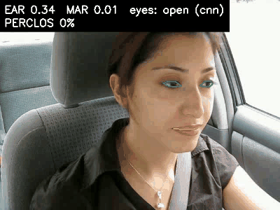
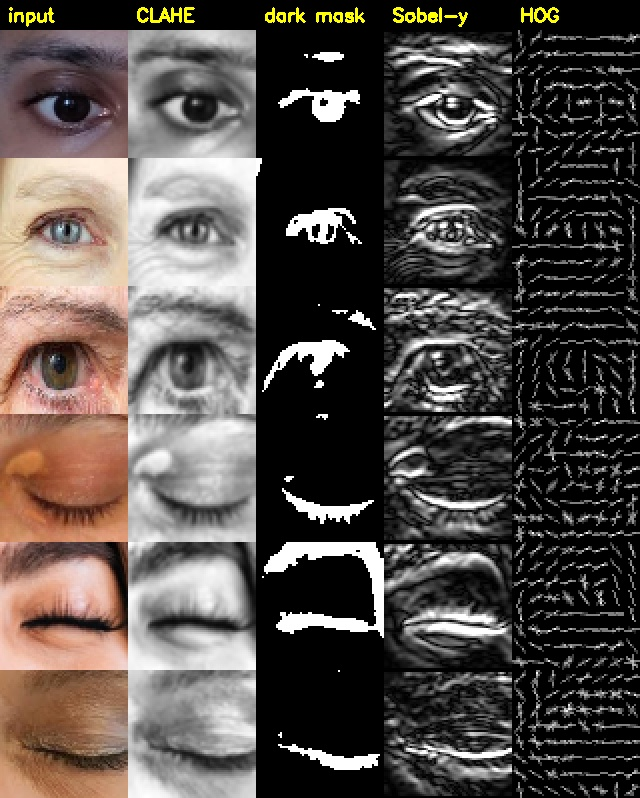
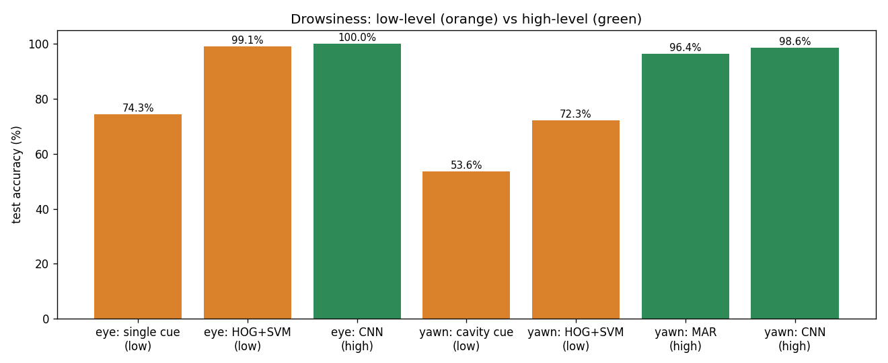
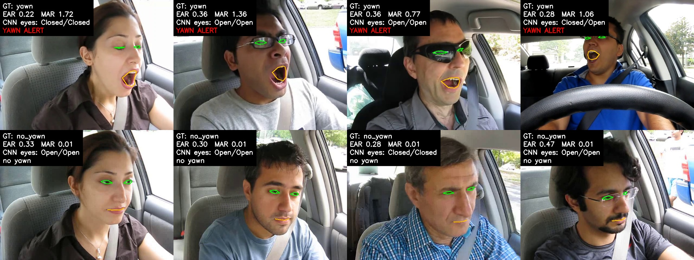

# Project 4: Driver Drowsiness Detection Using Computer Vision



## Problem statement
Driver fatigue causes a large share of road accidents. A drowsy driver closes their eyes for longer than a normal blink and yawns more often. A small in-car camera can watch for these signs and sound an alarm before the driver falls asleep.

## Objective
Recognise the two main visual signs of drowsiness:
1. **Eye state**: open or closed.
2. **Yawning**: yawn or no yawn.

Each is solved with a **low-level** approach (pixel measurements and hand-crafted features) and a **high-level** approach (CNNs and a facial-landmark network). The two are compared, then combined into a real-time monitor with temporal alert logic (consecutive closed frames, PERCLOS, yawn duration).

## Dataset
**Drowsiness_dataset** (Kaggle): https://www.kaggle.com/datasets/dheerajperumandla/drowsiness-dataset (169 MB)

| Class | Images | Content |
|---|---|---|
| Closed | 726 | close-up eye crops |
| Open | 726 | close-up eye crops |
| yawn | 723 | in-car driver frames (YawDD videos) |
| no_yawn | 725 | in-car driver frames |

**Leak-free split:** the yawn images are consecutive video frames, so a random split puts near-identical frames of the same person in train and test. We cluster near-duplicate images (thumbnail + agglomerative clustering) and assign **whole clusters** to train, val or test (≈ 70/15/15). This gives 73 person/session groups for the face frames. With a random split the low-level HOG-SVM scored an unrealistic 99 % on yawns; with the group split it scores 72 %. Details are in [`dataset/README.md`](dataset/README.md) and `src/prepare_data.py`.

## Methodology

### A. Low-level vision: `src/lowlevel_features.py`, `src/lowlevel_evaluate.py`
| Task | Pre-processing | Low-level cues | Classifiers |
|---|---|---|---|
| Eye | resize 64×64, grayscale, **CLAHE**, Gaussian blur | dark-blob **threshold + morphology** (iris round vs lash line), **Sobel** vertical/horizontal energy, **sclera** share (HSV), darkest-pixel share | (A) single-cue threshold rule; (B) **HOG** + cues → SVM |
| Yawn | resize, **YCrCb skin segmentation** → morphology → face blob | mouth ROI → CLAHE → dark cavity threshold, blob height/width, holes in skin mask | (A) single-cue rule; (B) HOG (frame) + cues → SVM |



### B. High-level vision: `src/train_cnn.py`, `src/landmarks.py`, `src/highlevel_evaluate.py`
- **CNN:** YOLOv8n-cls (ImageNet-pretrained) fine-tuned on all 4 classes, 224×224, 10 epochs.
- **MediaPipe Face Mesh:** a CNN that regresses 468 facial landmarks. From them we compute
  - **EAR** (eye aspect ratio) = (‖p2−p6‖ + ‖p3−p5‖) / (2‖p1−p4‖)
  - **MAR** (mouth aspect ratio) = (‖p2−p8‖ + ‖p3−p7‖ + ‖p4−p6‖) / (2‖p1−p5‖). Yawn if MAR > 0.35 (threshold chosen on train).

### C. Real-time monitor: `src/drowsiness_monitor.py`
Webcam or video → Face Mesh → eye state (choose `--method ear | cnn | lowlevel`) and MAR → **DROWSINESS ALERT** if the eyes stay closed for ≥ 15 frames or PERCLOS (share of closed-eye frames over the last 90) > 40 %; **YAWN ALERT** if MAR stays high for ≥ 10 frames.

## Tools / libraries
Python, OpenCV (CLAHE, Sobel, morphology, HOG, YCrCb), NumPy, scikit-learn (SVM, clustering, metrics), PyTorch + Ultralytics YOLOv8, **MediaPipe 0.10.14**, Matplotlib.

## Results (leak-free test split: 218 eye images, 220 face frames)

| Task | Method | Level | Accuracy | F1 |
|---|---|---|---|---|
| Eye closed vs open | single cue (dark-blob h/w) | low | 74.3 % | 79.6 % |
| | HOG + cues + SVM | low | 99.1 % | 99.2 % |
| | **CNN** | high | **100 %** | **100 %** |
| Yawn vs no yawn | single cue (dark cavity) | low | 53.6 % | 44.0 % |
| | HOG + cues + SVM | low | 72.3 % | 63.0 % |
| | **MediaPipe MAR rule** | high | **96.4 %** (AUC 99.7 %) | 96.0 % |
| | **CNN** | high | **98.6 %** | 98.5 % |
| All 4 classes | CNN | high | **99.3 %** | 99.3 % (macro) |

CNN inference takes 12.7 ms per image on CPU. Full numbers are in `results/lowlevel/lowlevel_metrics.json` and `results/highlevel/highlevel_metrics.json`.

| Low vs high level | Landmarks, EAR/MAR and CNN eye state on test frames |
|---|---|
|  |  |

## Conclusion
- **Eyes:** cropped eyes are a well-posed low-level problem. HOG gradients plus simple geometric cues already reach 99 %, and the CNN reaches 100 %.
- **Yawning:** in a full cabin frame the mouth is small and must first be *found*. Skin-colour face localisation breaks with seat colours, lighting and beards, so low-level methods reach only 54–72 %. High-level models that understand face structure (Face Mesh landmarks, CNN) reach 96–99 %.
- The final monitor uses high-level landmarks for localisation, a CNN or EAR for eye state, and simple temporal rules for alerts.

## How to run
```bash
pip install -r requirements.txt           # Python 3.9–3.12 (mediapipe 0.10.14)
kaggle datasets download -d dheerajperumandla/drowsiness-dataset -p raw --unzip
python src/prepare_data.py --src raw
python src/lowlevel_evaluate.py           # low-level results
python src/train_cnn.py --epochs 10       # high-level CNN (or use models/drowsy_cls_yolov8n.pt)
python src/highlevel_evaluate.py          # CNN + MediaPipe results
python src/drowsiness_monitor.py --method cnn      # LIVE webcam demo (press q to quit)
```
Included models: `models/drowsy_cls_yolov8n.pt` (CNN, 3 MB) and `models/eye_hog_svm.joblib` (low-level SVM). Full report: [`report.md`](report.md).
