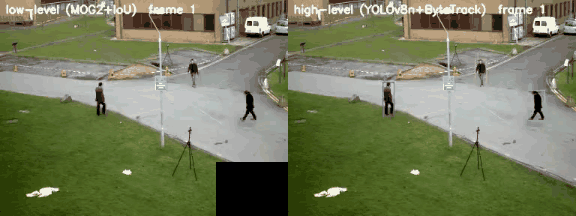
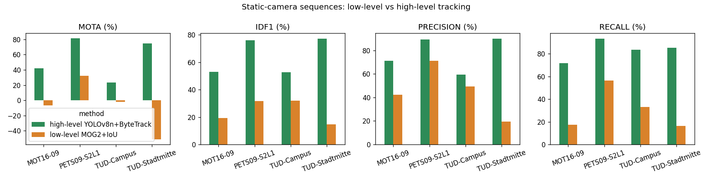
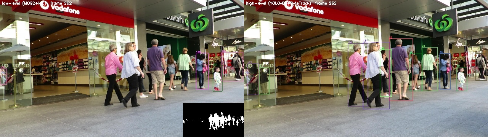
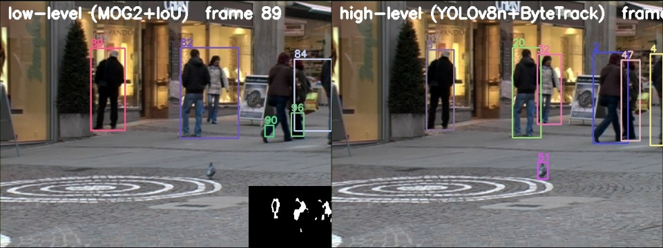

# Project 5: Multi-Object Tracking System (Pedestrians)


*Left: low-level (background subtraction + IoU tracker). Right: high-level (YOLOv8n + ByteTrack). Each colour and number is one track ID.*

## Problem statement
Surveillance, crowd analytics, robots and self-driving cars need to know **where every person is in every frame and keep a consistent identity for each of them**, even when people cross paths, get occluded or leave and re-enter the view. This is multi-object tracking (MOT): detection plus data association over time.

## Objective
1. **Low-level vision:** track people with no learned model: per-pixel background modelling, morphology, blob analysis and geometric (IoU) data association.
2. **High-level vision:** tracking-by-detection with a CNN person detector (YOLOv8n) and the ByteTrack association algorithm.
3. Evaluate both with the standard MOTChallenge metrics (MOTA, IDF1, precision, recall, ID switches) on public benchmark sequences with ground truth.

## Dataset
Six **MOTChallenge** benchmark sequences with full ground truth (IDs and boxes for every person in every frame):

| Sequence | Frames | Resolution | Camera | GT boxes | Source benchmark |
|---|---|---|---|---|---|
| MOT16-09 | 525 | 1920×1080 | static | 5,257 | MOT16 |
| PETS09-S2L1 | 795 | 768×576 | static | 4,650 | 2D MOT 2015 |
| TUD-Stadtmitte | 179 | 640×480 | static | 1,156 | 2D MOT 2015 |
| TUD-Campus | 71 | 640×480 | static | 359 | 2D MOT 2015 |
| MOT16-11 | 900 | 1920×1080 | **moving** | 9,174 | MOT16 |
| KITTI-17 | 145 | 1224×370 | **vehicle** | 782 | 2D MOT 2015 |

Official site: https://motchallenge.net. Kaggle mirror of MOT17 (same MOT16 videos): https://www.kaggle.com/datasets/wenhoujinjust/mot-17. See [`dataset/README.md`](dataset/README.md).

## Methodology

### A. Low-level vision (no learning): `src/lowlevel_tracker.py`
| Step | Operation |
|---|---|
| Background model | **MOG2**: Gaussian mixture per pixel (history 300, varThreshold 25, shadow detection), warm-up on the first 30 frames |
| Foreground clean-up | drop shadow pixels, **median filter** 5×5, **opening** 3×3, **closing** 9×15 ×2 and dilation (join body parts) |
| Blob analysis | **connected components** → boxes; keep area 0.06–8 % of the frame and height/width 1.1–4.5 (upright person) |
| Association | predict each track with constant velocity, then **Hungarian assignment** on 1 − IoU (gate IoU > 0.2) |
| Track management | new track for each unmatched blob, confirmed after 3 hits, deleted after 8 missed frames |

### B. High-level vision (deep learning): `src/highlevel_tracker.py`
- **YOLOv8n** (COCO-pretrained CNN), class *person* only, 960 px input, confidence ≥ 0.1.
- **ByteTrack**: Kalman-filter motion model plus two-stage Hungarian matching. High-confidence boxes are matched first; then **low-confidence boxes** are matched to remaining tracks, which keeps partly occluded people alive.

### Evaluation: `src/evaluate.py`, `src/mot_utils.py`
Standard MOTChallenge protocol using the `motmetrics` library: a prediction matches a GT box if IoU ≥ 0.5. Reported metrics:
- **MOTA** = 1 − (FN + FP + IDSW) / GT
- **IDF1**: identity F1 score
- **precision** and **recall**
- **ID switches**
- mostly tracked / mostly lost tracks
- FPS on CPU

## Tools / libraries
Python, OpenCV (MOG2, morphology, connected components), NumPy, SciPy (Hungarian algorithm), Ultralytics YOLOv8 + ByteTrack, motmetrics, pandas, Matplotlib.

## Results

**Static-camera sequences** (both methods, frame-weighted average over 4 sequences, 1,570 frames):

| Method | MOTA ↑ | IDF1 ↑ | Precision | Recall | ID switches ↓ | FPS (CPU) |
|---|---|---|---|---|---|---|
| Low-level MOG2 + IoU | 8.1 % | 25.6 % | 54.7 % | 37.8 % | 101 | **39.9** |
| **High-level YOLOv8n + ByteTrack** | **64.8 %** | **67.4 %** | **81.9 %** | **84.8 %** | 99 | 5.9 |

**Moving / vehicle camera** (MOT16-11 and KITTI-17, high-level only, since background subtraction can't work there): MOTA 48.2 %, IDF1 55.7 %.

Per-sequence results:

| Sequence | Low-level MOTA / IDF1 | High-level MOTA / IDF1 |
|---|---|---|
| PETS09-S2L1 | 32.2 / 31.7 | **81.4 / 76.0** |
| TUD-Stadtmitte | −51.3 / 14.7 | **74.7 / 77.3** |
| MOT16-09 | −6.7 / 19.2 | **42.0 / 53.0** |
| TUD-Campus | −1.9 / 32.0 | **23.4 / 52.8** |
| MOT16-11 (moving) | – | 51.1 / 53.8 |
| KITTI-17 (vehicle) | – | 29.9 / 67.5 |



| MOT16-09: low-level vs high-level | TUD-Stadtmitte: low-level vs high-level |
|---|---|
|  |  |

Tracking videos for every sequence are in `results/lowlevel/*.mp4` and `results/highlevel/*.mp4`. Results in MOTChallenge txt format are in `results/*/<SEQ>.txt`, per-sequence metrics in `results/per_sequence_metrics.csv`, and the summary in `results/metrics.json`.

## Conclusion
Background subtraction is **7× faster** and works reasonably on a clean, elevated static view with separated people (PETS09: MOTA 32 %). But it has no notion of "person": groups merge into one blob, people who stand still fade into the background, and shadows, reflections and moving objects become false tracks. On crowded, close-up scenes MOTA is negative. The high-level tracker recognises people directly and uses a motion model plus low-score re-association, giving **MOTA 64.8 % vs 8.1 %** on static cameras, and it also works with a moving camera. Low-level motion cues remain useful as a cheap trigger (e.g. only run the CNN when something moves).

## How to run
```bash
pip install -r requirements.txt
# get the sequences into data/sequences/<SEQ>/{img1,gt}  (see dataset/README.md)
python src/lowlevel_tracker.py --seq PETS09-S2L1       # one sequence, low-level
python src/highlevel_tracker.py --seq PETS09-S2L1      # one sequence, high-level
python src/evaluate.py                                 # all sequences + metrics + chart
```
YOLOv8n weights (`yolov8n.pt`) are downloaded automatically by Ultralytics on first use. Full report: [`report.md`](report.md).
